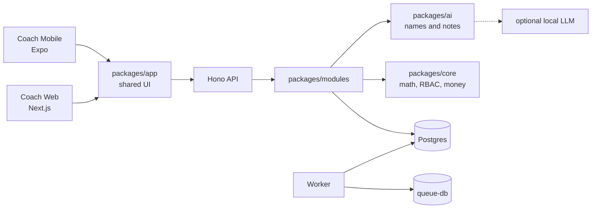

# GymOS

[](https://github.com/KhubaibQaiser/fitness-app/actions/workflows/ci.yml)

Coaching-first operating system for independent coaches and boutique gyms. GymOS drafts meal plans, captures vitals, and runs weekly check-ins without letting a language model invent calories, macros, or allergens.

The current product is a **coach-only pilot**: one coach, shared web and Expo screens, a Hono API, and a hybrid nutrition engine that stays draft until the coach publishes. A member app is not in this repository yet.

| Topic  | Detail                                                                                               |
| ------ | ---------------------------------------------------------------------------------------------------- |
| Status | Pilot (`v0`). Coach web is the primary surface; coach mobile is an Expo shell over the same screens. |
| Stack  | TypeScript monorepo (Turborepo, pnpm), Next.js, Expo, Hono, Postgres 17, Drizzle                     |
| Pilot  | [gymos-pilot.duckdns.org](https://gymos-pilot.duckdns.org)                                           |

## Why this exists

Generic “AI meal planners” fail coaches in predictable ways: the model invents numbers, auto-publishes to clients, or sends PII to a hosted API. GymOS splits the work so those failure modes are structurally impossible.

1. **Physiology and a deterministic solver** own targets, portions, allergens, and safety floors (`packages/core`).
2. **An optional local LLM** names meals and writes prep notes only. It never emits kcal or macros. If the model fails, templates take over.
3. **The coach** reviews, edits, and publishes. Generation never auto-publishes.

Details: [ADR-0001](docs/adr/0001-hybrid-ai-nutrition.md).

## What ships today

- Client onboarding (identity, goals, dietary constraints, consent)
- Vitals capture and a client roster
- Hybrid meal-plan generation → coach review / swap / portion edit → explicit publish
- Weekly check-ins and deterministic adaptive recommendations
- Email/password JWT sessions (access + rotating refresh)
- Org/outlet scoping with RLS as a backstop, plus a per-org config registry

Coach mobile (`apps/mobile`) shares `@gymos/app`. Local DX is in [`apps/mobile/README.md`](apps/mobile/README.md).

## Architecture

Interactive map (source of truth is JSON; do not hand-edit the HTML):

- Spec: [`docs/architecture/gymos.architecture.json`](docs/architecture/gymos.architecture.json)
- Artifact: [`docs/architecture/gymos.html`](docs/architecture/gymos.html)



| Path                 | Role                                                           |
| -------------------- | -------------------------------------------------------------- |
| `apps/web`           | Next.js 16 coach PWA                                           |
| `apps/api`           | Hono modular monolith; Zod → OpenAPI                           |
| `apps/worker`        | pg-boss jobs (same image as API)                               |
| `apps/mobile`        | Expo Router shell; Metro bundle gated in CI                    |
| `packages/app`       | Shared coach screens (RN primitives + Tamagui)                 |
| `packages/ui`        | Design-system primitives                                       |
| `packages/platform`  | Platform façade (storage, theme, download)                     |
| `packages/modules`   | Domain public APIs; no cross-module table access               |
| `packages/core`      | Pure TS: nutrition, money (bigint minor units), units, `can()` |
| `packages/ai`        | Layer-3 narrative only; fail closed to templates               |
| `packages/db`        | Drizzle schema and migrations                                  |
| `packages/contracts` | Shared Zod / OpenAPI                                           |

Data: Postgres 17 (Neon in production, Docker locally). Object storage is R2 in production and MinIO locally. Queue state lives in a separate, ephemeral Postgres so pg-boss never holds tenant data.

If the Oracle Always Free VM path is blocked, the stripped PaaS pilot is documented in [`docs/pilot-go-live-paas.md`](docs/pilot-go-live-paas.md) (IaC in [`infra/paas/`](infra/paas/)).

## Quick start

Requires **Node 22** (see `.nvmrc`), **pnpm** (Corepack, version pinned in `package.json`), and **Docker**.

```bash
nvm use
corepack enable
pnpm install
cp .env.example .env          # placeholders only — never commit .env
docker compose up -d          # Postgres, queue-db, MinIO
pnpm db:migrate && pnpm db:seed
pnpm dev                     # web :3000, api :8080, worker
```

Open [http://localhost:3000/login](http://localhost:3000/login). Seeded coach:

- Email: `coach@pilot.local`
- Password: `PILOT_COACH_PASSWORD` from `.env` (default after seed: `pilot-coach-change-me`)

Local Layer-3 defaults to `AI_MODE=fallback` (no LLM). To narrate with llama.cpp, set `AI_MODE=local` and point `AI_BASE_URL` at your runtime. Hosted OpenAI-compatible APIs are an escape hatch, not the default.

## Commands

| Command                            | Purpose                                   |
| ---------------------------------- | ----------------------------------------- |
| `pnpm dev`                         | Web, API, and worker (loads root `.env`)  |
| `pnpm db:migrate` / `pnpm db:seed` | Schema and pilot data                     |
| `pnpm lint`                        | ESLint, including module-boundary rules   |
| `pnpm typecheck`                   | Workspace TypeScript                      |
| `pnpm test`                        | Unit and API integration tests            |
| `pnpm format:check`                | Prettier                                  |
| `pnpm --filter @gymos/web build`   | Production web build                      |
| `pnpm archify:validate`            | Architecture-spec CI gate                 |
| `pnpm archify:deliver`             | Regenerate `docs/architecture/gymos.html` |

## Quality gates

Every pull request runs [`.github/workflows/ci.yml`](.github/workflows/ci.yml):

- Secret scan (gitleaks, full history)
- Format, lint (module boundaries), typecheck
- OpenAPI drift (`openapi:generate` then `git diff --exit-code`)
- Architecture validation (`pnpm archify:validate`)
- Unit and API integration tests
- Web production build
- Playwright smoke on `/login` (no API)
- Production dependency audit (`pnpm audit --prod --audit-level high`)
- iOS Metro export (`expo export --platform ios`)

Not merge-gated: Maestro device flows, Lighthouse, authenticated roster e2e. Nightly Layer-3 live eval is [`.github/workflows/ai-eval.yml`](.github/workflows/ai-eval.yml) when `AI_BASE_URL` is set.

Install [gitleaks](https://github.com/gitleaks/gitleaks/releases) on `PATH` (for example `~/.tools/bin`). Lefthook runs it on pre-commit (staged) and pre-push (history).

## Documentation

| Doc                                  | Contents                                                              |
| ------------------------------------ | --------------------------------------------------------------------- |
| [`docs/roadmap.md`](docs/roadmap.md) | Current phase and sequencing                                          |
| [`docs/adr/`](docs/adr/)             | Architecture decisions                                                |
| [`docs/specs/`](docs/specs/)         | Feature specs (current behavior)                                      |
| [`docs/runbooks/`](docs/runbooks/)   | Operations                                                            |
| [`docs/pitch/`](docs/pitch/)         | Technical investor brief                                              |
| [`AGENTS.md`](AGENTS.md)             | Contract for coding agents                                            |
| [`CLAUDE.md`](CLAUDE.md)             | Alignment initiative (wins on conflict with older architecture notes) |

## Security

- **No secrets in git.** `.env.example` is placeholders only. A gitleaks finding fails CI.
- `/v1` requires a JWT except public auth routes. External traffic is HTTPS (HSTS) in the VM/Caddy path.
- The LLM container, when used, has no network egress. Do not send PII to Layer-3; `assertDeidentified` is required at that boundary.
- Report vulnerabilities through a **private GitHub security advisory**, not a public issue.

## Contributing

One logical change per PR. Link a spec under `docs/specs/` or an ADR. Include a test that would have failed before the change. `CODEOWNERS` requires human review on `packages/core`, `packages/ai`, and `infra/`.

Agent and contributor map:

- **Archify** — runtime topology. Edit the JSON, then `pnpm archify:validate` and `pnpm archify:deliver`. Lefthook re-renders HTML when architecture files are staged.
- **Graphify** — local knowledge graph (`graphify-out/` is gitignored). Install the `graphify` CLI and run `graphify query` / `path` / `explain` after a local build.

## License

This repository does not publish a `LICENSE` file. Treat the source as all rights reserved until one is added.
