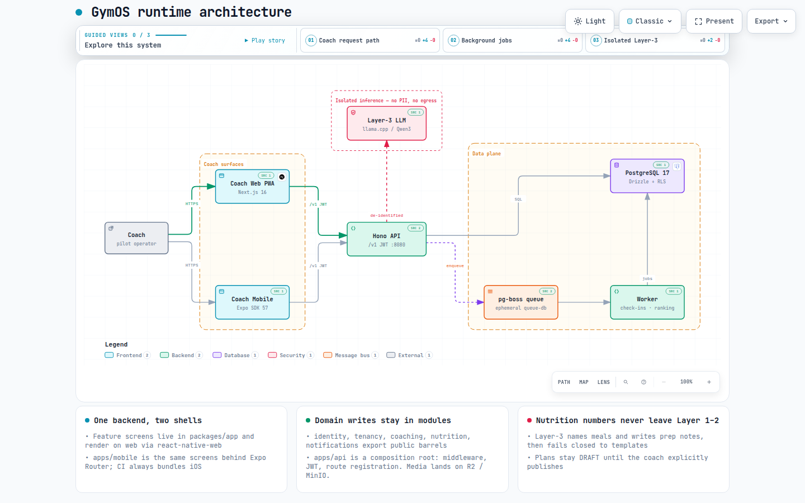
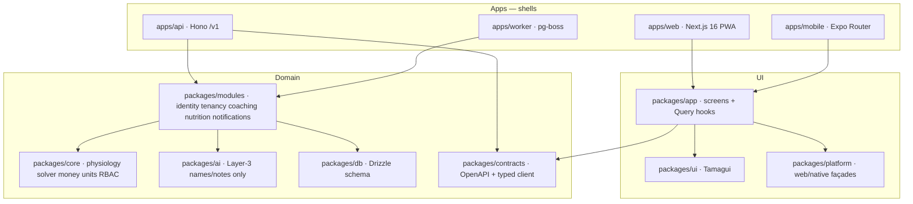
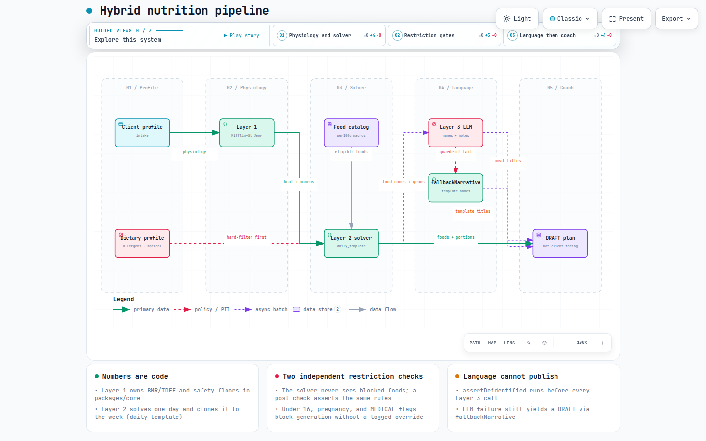
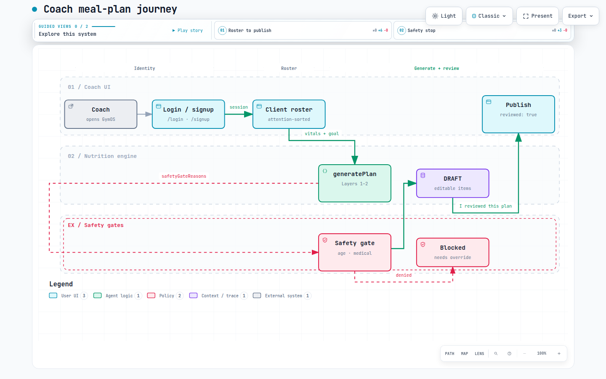
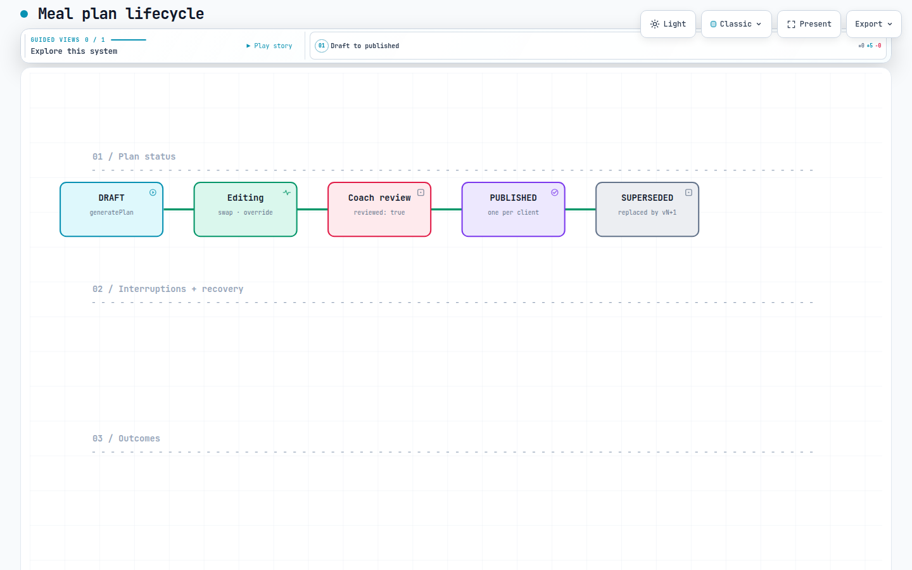

# GymOS

[](https://github.com/KhubaibQaiser/fitness-app/actions/workflows/ci.yml)

**Coaching-first operating system for gyms.** GymOS helps a coach run the weekly loop — roster, vitals, goals, check-ins, and meal plans — without letting a language model invent calories, macros, or allergens.

The product today is **coach-only**. There is no client/member app yet. Feature screens live once in `packages/app` and ship on the web PWA now; native iOS/Android is the same UI behind Expo Router.

> Nutrition numbers are code. Language is optional. Publish is always a human.

Interactive architecture diagrams (pan, zoom, search, light/dark) live under [`docs/architecture/`](docs/architecture/). Open the HTML files locally after clone.

---

## What it does

A coach can:

1. Sign in (email/password) or create an account with a hashed, peppered email OTP.
2. Onboard clients, capture vitals as a time series, and set a goal with safety floors.
3. Generate a **DRAFT** meal plan from physiology + a deterministic food-catalog solver.
4. Optionally name meals with a local LLM (llama.cpp / Qwen). The model never emits kcal or macros. Failure falls back to templates.
5. Edit, swap foods, or override item macros. Totals recompute from `per100g × grams`.
6. Explicitly publish after review (`reviewed: true`). Nothing auto-publishes.
7. Run weekly check-ins; a worker rolls attention, rankings, and cleanup overnight.

Pilot economics stay near $0/month (Neon Postgres, optional Oracle/Caddy or Vercel + Render). See [`docs/pilot-go-live.md`](docs/pilot-go-live.md) and [`docs/pilot-go-live-paas.md`](docs/pilot-go-live-paas.md).

---

## Architecture

[Open interactive runtime map](docs/architecture/gymos-runtime.html)



Coach web (Next.js 16 PWA) and coach mobile (Expo SDK 57) call one Hono modular-monolith API (`/v1`, JWT + rotating refresh). Domain writes go through `packages/modules` public barrels. Durable state is PostgreSQL 17 (Drizzle, `org_id` / `outlet_id`, RLS). Background work is pg-boss on a **separate ephemeral queue-db** so the worker never keeps Neon awake. Layer-3 inference is isolated: de-identified food names and grams only, no PII, no egress from the LLM container.

Source of the diagram: [`docs/architecture/gymos-runtime.architecture.json`](docs/architecture/gymos-runtime.architecture.json) (revision-pinned to the repo).

### Package graph



| Package              | Role                                                                                                  |
| -------------------- | ----------------------------------------------------------------------------------------------------- |
| `apps/web`           | Coach web/PWA shell. Renders `@gymos/app`.                                                            |
| `apps/mobile`        | Expo coach shell. CI bundles iOS Metro even while native is unshipped.                                |
| `apps/api`           | Hono composition root: middleware, JWT, route registration.                                           |
| `apps/worker`        | Nightly jobs: check-in roll, attention, food ranking, cleanup.                                        |
| `packages/app`       | Shared coach screens (Tamagui / RN primitives, Solito, TanStack Query).                               |
| `packages/ui`        | Design system.                                                                                        |
| `packages/platform`  | Storage, theme, download, `isWeb` — no `Platform.OS` in feature code.                                 |
| `packages/contracts` | Committed OpenAPI 3.1 + typed client. The app/API seam.                                               |
| `packages/core`      | Pure TypeScript: nutrition math, money (`bigint` minor units), units, `can(actor, action, resource)`. |
| `packages/modules`   | Backend domains. Import public `index.ts` barrels only.                                               |
| `packages/db`        | Drizzle schema, migrations, seed.                                                                     |
| `packages/ai`        | Layer 3 — language only. `assertDeidentified` at the boundary.                                        |

Lint enforces this with `eslint-plugin-boundaries`. Do not add routes to `apps/api/src/app.ts`; register them in `apps/api/src/routes/`.

---

## Hybrid nutrition (the safety architecture)

[Open interactive data flow](docs/architecture/hybrid-nutrition.html)



| Layer                   | Owner                                                                                                    | Learns?                          | Emits numbers?       |
| ----------------------- | -------------------------------------------------------------------------------------------------------- | -------------------------------- | -------------------- |
| **1 — Physiology**      | `packages/core` (Mifflin–St Jeor / Katch–McArdle, safety floors)                                         | No                               | Yes — targets        |
| **2 — Solver**          | `packages/core` + food catalog. Seeded, reproducible. Hard-filters restrictions first, then post-checks. | Rank scores only (deterministic) | Yes — foods + grams  |
| **3 — Language**        | `packages/ai` (`narrate`). Schema + numeric-claim + groundedness guardrails.                             | Prompt/adapter, eval-gated       | **No**               |
| **4 — Personalization** | Coach edits → `ai_feedback_events` → nightly `food_rankings`                                             | Yes, not the model weights first | Indirect via Layer 2 |

Full decision record: [`docs/adr/0001-hybrid-ai-nutrition.md`](docs/adr/0001-hybrid-ai-nutrition.md). Specs: [`docs/specs/fr-c6-plan-publish.md`](docs/specs/fr-c6-plan-publish.md), [`docs/specs/fr-c7-dietary-profile.md`](docs/specs/fr-c7-dietary-profile.md).

---

## User journeys

### Coach meal-plan path

[Open interactive workflow](docs/architecture/coach-journey.html)



Primary screens (shared `@gymos/app`):

| Route                                       | Screen                                          |
| ------------------------------------------- | ----------------------------------------------- |
| `/login`, `/signup`, `/forgot-password`     | Auth (OTP on signup/reset)                      |
| `/`                                         | Home                                            |
| `/clients`, `/clients/new`, `/clients/[id]` | Roster and client hub                           |
| `/clients/[id]/vitals/new`, `.../goal/new`  | Vitals and goals                                |
| `/clients/[id]/meal-plan`                   | Draft / publish plan                            |
| `/clients/[id]/dietary`                     | Dietary profile (severe allergies stay visible) |
| `/clients/[id]/check-in`                    | Weekly check-in                                 |
| `/notifications`, `/settings`, `/tools`     | Alerts, coach settings, calculators             |

Signup OTP rules: [`docs/specs/fr-c1-coach-signup-otp.md`](docs/specs/fr-c1-coach-signup-otp.md).

### Meal plan states

[Open interactive lifecycle](docs/architecture/meal-plan.html)



`plan_status`: `DRAFT` → (edit / review) → `PUBLISHED` → `SUPERSEDED` when a newer version publishes. A dietary write can force `NEEDS_REVIEW` (HIGH-priority coach notification). `ARCHIVED` is terminal. Safety gates can block generation (`BLOCKED_REQUIRES_OVERRIDE`) until an audited coach override.

One PUBLISHED plan per client (partial unique index).

---

## Consume the repo

This is a **pnpm + Turborepo** application monorepo, not a published npm library. Packages are `private: true`. You consume it by running the apps, or by importing workspace packages from those apps.

**HTTP API.** The committed spec is [`packages/contracts/openapi/openapi.v1.json`](packages/contracts/openapi/openapi.v1.json). After `pnpm dev`, the API listens on `:8080`. Typed client: `@gymos/contracts`.

**Domain logic.** Apps and modules import `@gymos/core/nutrition`, `@gymos/core/rbac`, `@gymos/core/money`, `@gymos/core/units`. Do not reimplement BMR, floors, or `can()`.

**UI.** New coach screens go in `packages/app`, then a thin route in `apps/web` / `apps/mobile`. No raw `<div>`, no raw `fetch`, no `Platform.OS` in `packages/app`.

---

## Getting started

Requirements: **Node 22** (see `.nvmrc`), pnpm 10 (Corepack), Docker for local Postgres / queue-db / MinIO.

```bash
nvm use                 # Node 22
corepack enable         # pnpm version pinned in package.json
pnpm install
cp .env.example .env    # placeholders only — never commit .env
docker compose up -d    # Postgres :5432, queue-db :5434, MinIO :9000
pnpm db:migrate && pnpm db:seed
pnpm dev                # web :3000, api :8080, worker
```

Open `http://localhost:3000/login` as `coach@pilot.local` with `PILOT_COACH_PASSWORD` from `.env` (seed default: `pilot-coach-change-me`).

Useful scripts:

| Script                                      | What                               |
| ------------------------------------------- | ---------------------------------- |
| `pnpm dev`                                  | Turbo dev (loads root `.env`)      |
| `pnpm lint`                                 | ESLint including module boundaries |
| `pnpm typecheck`                            | `tsc --noEmit` across workspaces   |
| `pnpm test`                                 | Vitest (unit + API integration)    |
| `pnpm format:check`                         | Prettier                           |
| `pnpm --filter @gymos/web build`            | Production web build               |
| `pnpm --filter @gymos/api openapi:generate` | Refresh OpenAPI; CI diffs it       |

Agent contract (where code may live, nutrition rules, merge gates): [`AGENTS.md`](AGENTS.md). Alignment phases and design tokens: [`CLAUDE.md`](CLAUDE.md).

---

## How to work on it

1. **One logical unit per PR.** Name the alignment phase or AI-native track in the PR body. Link a spec under [`docs/specs/`](docs/specs/) or an ADR under [`docs/adr/`](docs/adr/).
2. **Put domain writes in `packages/modules` public exports.** `apps/api` only composes.
3. **Nutrition numbers stay in Layers 1–2.** Layer-3 payloads must pass `assertDeidentified`. Plans stay `DRAFT` until explicit publish.
4. **Add a test that would have failed before the change.**
5. **Verify** `pnpm lint`, `pnpm typecheck`, and scoped `pnpm test` (full workspace if `packages/contracts` or shared types changed). Touching web/app/ui/platform also needs `pnpm --filter @gymos/web build`.

`CODEOWNERS` requires human review on `packages/core`, `packages/ai`, and `infra/`. Agents propose; they do not bypass that.

### CI merge gates

`.github/workflows/ci.yml`: gitleaks, format, lint (module boundaries), typecheck, OpenAPI drift, unit/integration tests, web build, Playwright `/login` smoke, prod audit, iOS Metro export.

Not gated: Maestro, Lighthouse, authenticated roster e2e.

---

## Documentation map

| Doc                                        | Use when                                               |
| ------------------------------------------ | ------------------------------------------------------ |
| [`docs/architecture/`](docs/architecture/) | Interactive Archify diagrams + regenerate instructions |
| [`docs/adr/`](docs/adr/)                   | Accepted architecture decisions                        |
| [`docs/specs/`](docs/specs/)               | Machine-checkable feature invariants                   |
| [`docs/roadmap.md`](docs/roadmap.md)       | Current phase vs later product bets                    |
| [`docs/runbooks/`](docs/runbooks/)         | Ops (down, OTP, generation failures, restore)          |
| [`docs/ai/`](docs/ai/)                     | Model card, prompt canary, LoRA ops                    |
| [`docs/pitch/`](docs/pitch/)               | Technical investor brief                               |

Architecture scorecard of the brownfield repo: [`docs/adr/0007-alignment-audit.md`](docs/adr/0007-alignment-audit.md).

---

## Security

- **No secrets in git.** `.env.example` is placeholders. gitleaks runs pre-commit, pre-push, and in CI.
- `/v1` requires a JWT except public auth routes. Sessions are rotating refresh (ADR-0002).
- Layer-3 sees food names + grams only. The LLM container has no network egress in the intended deploy.
- No tenant-name conditionals (`if (tenant === …)`). Tenancy is data (`org_id` / `outlet_id`), never a fork.
- Report vulnerabilities via a private GitHub security advisory, not a public issue.

---

## License

This repository does not currently publish a license file. Treat it as source-available for collaboration on GymOS unless the owners state otherwise.
