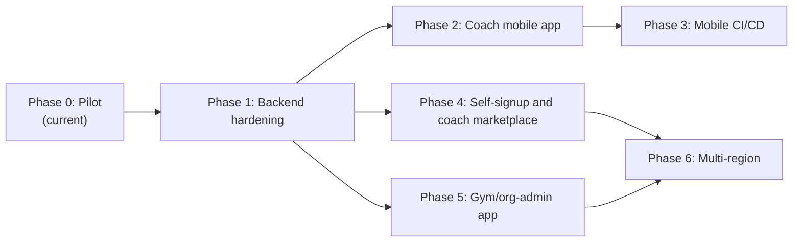

# GymOS Platform Roadmap

Living document. Revised at the start and end of each phase. Major architectural
decisions land as ADRs under [`docs/adr/`](./adr/) — this file tracks **where we
are**, **what comes next**, and **why the order matters**.

Last updated: 2026-08-11 (Phase 3 mobile CI/CD in progress; Phase 4 rescoped to
self-signup + coach marketplace, not yet started).

---

## Guiding principle

The backend — auth, RBAC, domain modules, and the contracts client — is the **one
thing every app depends on**: coach web, coach mobile, the future client app, and
the gym/org-admin app. Every phase must leave that layer **more solid and more
scalable**, not less, before new UI surfaces are added.

Frontend apps are deployments of shared feature packages (`packages/app*`) onto
platform shells (`apps/web*`, `apps/mobile*`). They must not invent their own
auth, tenancy, or authorization models.

---

## Where we are today (Phase 0 — Pilot)

| Layer    | State                                                                                                       |
| -------- | ----------------------------------------------------------------------------------------------------------- |
| Product  | Single-coach, coaching-first web app: vitals, goals, check-ins, coach-reviewed meal plans                   |
| Monorepo | Turborepo + pnpm: `apps/{web,api,worker,mobile}`, `packages/{app,ui,platform,contracts,core,modules,db,ai}` |
| Frontend | Next.js 16 + Solito + Tamagui + react-native-web; screens in `packages/app`; Expo Router in `apps/mobile`   |
| Auth     | Email + password; JWT access + rotating refresh sessions (ADR-0002) — replaces shared gate cookie           |
| Tenancy  | Shared-schema + app scoping + RLS backstop (ADR-0003); per-org config registry (ADR-0004)                   |
| RBAC     | Full role matrix in `@gymos/core/rbac`; list queries scoped by org / outlet / assignment                    |
| Data     | Neon Postgres 17, Drizzle ORM                                                                               |
| Deploy   | PaaS pilot (Vercel web + Render API + Neon) and/or Oracle VM path                                           |
| Mobile   | **In progress** — Expo Router app (ADR-0005) + CI bundle/EAS/Maestro workflows                              |

Phase markers already in code (`P0`–`P5`) map roughly onto the phases below; this
document is the authoritative sequencing.

---

## Phase map

Phases 2/3 (coach mobile) and 4/5 (marketplace, gym-admin) all branch off
Phase 1. They are independent apps/surfaces on one hardened backend — not a
strict chain. After Phase 1, sequencing 2/3 vs 4/5 is a product-priority call.
This roadmap executed 2/3 first (coach mobile was the original request);
Phase 4 was rescoped afterward when the product direction shifted from
admin/coach-provisioned accounts to self-service signup — see below.

---

## Phase 0 — Pilot (complete, in production)

**Scope.** Single-coach responsive web app; hybrid nutrition engine; coach review
before publish; free-tier infrastructure.

**Exit criteria (met).** Coach can onboard clients, record vitals, generate /
edit / publish meal plans, run weekly check-ins with adaptive adjustments;
PaaS or VM deploy path live.

**Non-goals (deferred intentionally).** Per-user login, native mobile, client
facing app, multi-org, push notifications.

---

## Phase 1 — Backend hardening (in progress)

**Why first.** A process-global principal cache, unscoped list queries, an
in-process rate limiter, and missing tenant columns on several tables are fine
for one coach — and become correctness / security bugs the moment a second user
or organization exists. Mobile, client, and gym-admin all consume this layer.

**Scope.**

| Slice | Outcome                                                                                                         |
| ----- | --------------------------------------------------------------------------------------------------------------- |
| 1a    | Real per-user auth: email + password, short-lived JWT access token, rotating refresh tokens, session revocation |
| 1b    | Per-request principal resolution from the verified JWT (no process-global cache)                                |
| 1c    | List/query endpoints filter by org / outlet / assigned clients; cross-tenant isolation tests                    |
| 1d    | Postgres Row-Level Security as defense-in-depth (session GUCs)                                                  |
| 1e    | Backfill `outlet_id` / `org_id` onto tables that only had `client_id`; composite tenant-leading indexes         |
| 1f    | Shared-store rate limiting (correct under multi-instance API)                                                   |
| 1g    | Per-org tenant config registry (replace single cached manifest file)                                            |
| 1h    | ESLint `app-client` / `app-admin` boundaries reserved ahead of those apps                                       |

**Entry criteria.** Phase 0 live; plan approved.

**Exit criteria.**

- Login issues access + refresh tokens; `/v1/*` accepts `Authorization: Bearer`
  (web: httpOnly refresh cookie + in-memory access token; mobile: SecureStore).
- Concurrent distinct users never share principal state.
- Cross-tenant list queries return zero rows in integration tests.
- RLS policies active on tenant-scoped tables.
- Rate limit remains correct with ≥2 API instances.
- ADR(s) recorded for auth and multi-tenant isolation choices.

**Non-goals.** SSO / SAML / OIDC; schema-per-tenant or DB-per-tenant; push
notifications; progress-photo upload APIs.

---

## Phase 2 — Coach mobile app (in progress)

**Scope.** `apps/mobile`: Expo + Expo Router, native-only, feature parity with
the coach web app by reusing `@gymos/app` screens. Platform `.native` / `.web`
splits for storage, theme, desktop breakpoint, PDF share, signature pad. Shell
fixes for flex + safe-area (no `100vh` / `position: fixed`).

**Entry criteria.** Phase 1 exit criteria met (mobile authenticates via the same
JWT / refresh contract).

**Exit criteria.** All coach routes reachable on iOS and Android simulators /
dev clients; auth login / refresh / logout works; PDFs shareable; signature pad
works on device.

**Non-goals.** Client or gym-admin mobile surfaces; Expo web target; store
submission.

**Working PR.** Stacked after Phase 1 PRs — see `cursor/coach-mobile-app-6eda`.

---

## Phase 3 — Mobile CI/CD (in progress)

**Scope.** Bundle-check in `ci.yml`; EAS preview builds + OTA updates on PRs;
EAS production update / build+submit on `main` (gated until Apple / Google
accounts exist); Jest + RNTL unit tests; Maestro critical-path E2E.

**Entry criteria.** Phase 2 app boots and typechecks.

**Exit criteria.** PR merges cannot land a broken Metro bundle; labeled PRs get
installable previews; `main` can OTA JS-only changes and auto-build on native
fingerprint changes when `PILOT_MOBILE_DEPLOY_ENABLED=true`.

**Non-goals.** Public App Store / Play Store release automation without human
promote; Detox as default E2E (reserved for gray-box hotspots only).

**Working PR.** Stacked after Phase 2 — see `cursor/mobile-cicd-6eda`.

---

## Phase 4 — Self-signup and coach marketplace (rescoped, not started)

**Why rescoped.** The original Phase 4 assumed a _seeded, admin/coach-provisioned_
client logging in to view a published plan. Product direction has since shifted:
coaches should be able to self-signup (optionally linking to an existing gym via
a join code), clients should be able to self-signup, browse a public directory
of coaches, and hire one directly — with no admin in the loop. Both sides then
communicate in-app around a shared plan and vitals history. This is a bigger
change than the original Phase 4 and touches identity, not just a new frontend,
so it gets its own sub-phased rollout (mirrors the Phase 1a–1h slicing).

**Key decision — "coach is the tenant".** Independent coaches each get their
own `organizations`/`outlets`/`tenant_configs` row auto-provisioned at signup
(or join an existing org via a `joinCode`). Client signup and "hiring" a coach
are the _same_ atomic call, so a logged-in user always has a real membership —
this preserves the ADR-0002/0003 invariant that every JWT carries a real
`orgId`/`outletId`, instead of introducing an "unaffiliated user" auth state.
The public coach directory is the one deliberately cross-tenant read path
(opt-in fields only) and needs extra review scrutiny for that reason.

**Scope.**

| Slice | Outcome                                                                                                                             |
| ----- | ----------------------------------------------------------------------------------------------------------------------------------- |
| 4a    | ADR-0006 + migration: `coachProfiles`, `conversations`/`messages`, `organizations.joinCode`; `resolvePrincipal` resolves `clientId` |
| 4b    | Coach self-signup (`POST /v1/auth/signup/coach`): auto-provision org/outlet/tenant-config, or join by code                          |
| 4c    | Public coach directory (`GET /v1/coaches/directory`) + atomic client signup-and-hire (`POST /v1/auth/signup/client`)                |
| 4d    | RBAC/API glue: wire `ownerUserId` into self-scoped `authorize()` calls so clients can read own plan/vitals/dietary                  |
| 4e    | In-app messaging: `conversations`/`messages` scoped to the active `coachAssignment`, polling-based (no push/websockets yet)         |
| 4f    | `packages/app-client` UI: directory browse, hire CTA, client home (plan/progress), messages — web + mobile                          |

**Entry criteria.** Phase 1 complete.

**Exit criteria.** A coach can self-signup (with or without a join code) and
land on their own tenant; a client can browse public coach profiles, sign up,
and hire a coach in one step; the resulting client can log in and read their
own published plan and vitals history; coach and client can exchange messages
tied to their active assignment; no cross-tenant data leaks through the
directory beyond opted-in public fields.

**Non-goals.** Concurrent multi-coach clients; coach switching/rehiring;
payments/billing for hiring; real-time chat or push notifications (v1 is
polling); multi-coach practices/teams under one org; ratings/reviews; content
moderation; guardian/dependent accounts.

---

## Phase 5 — Gym / org-admin app

**Scope.** Cross-outlet reporting and management for a gym chain
(`ORG_ADMIN` with `outlet_id = NULL` already means “all branches in this org”).
Web-first dashboards (`packages/app-admin` + `apps/web-admin`).

**Entry criteria.** Phase 1 complete; at least one multi-outlet org in staging.

**Exit criteria.** Org admin can list outlets, see aggregated roster / attention
across branches, manage memberships; cannot see other organizations.

**Non-goals.** Platform-operator cross-org console (distinct from chain
`ORG_ADMIN`); billing / invoicing.

---

## Phase 6 — Multi-region

**Scope.** Independent regional deployments (separate Neon project + API per
region) when a paying customer requires a distant geography or hard data
residency. Route new orgs to the nearest region at signup.

**Entry criteria.** Real customer / compliance need; Phases 1 and at least one
of 4/5 in production.

**Exit criteria.** Second region serves its orgs with local read/write latency;
no silent cross-region data mixing.

**Non-goals.** Active-active synchronous multi-region Postgres; premature
schema-per-tenant or DB-per-tenant (revisit only for enterprise isolation /
noisy-neighbor / compliance triggers).

---

## Explicitly deferred (all phases)

- SSO / SAML / OIDC federation
- Active-active multi-region database
- Schema-per-tenant or DB-per-tenant as the default model
- Push notifications (FCM / APNs)
- Progress-photo upload API (table exists; no endpoints yet)
- Store submission without Apple / Google developer accounts
- Guardian / dependent access
- Concurrent multi-coach clients / coach switching or rehiring
- Payments / billing for coach hiring
- Real-time chat or push-notified messaging (Phase 4 messaging is polling-based)
- Coach teams / multiple coaches under one self-signup org
- Ratings, reviews, or content moderation for the coach directory

---

## How to update this document

1. At **phase kickoff**: set status to _in progress_, link the working PR(s).
2. At **phase exit**: mark exit criteria met, link merged PRs and any new ADRs.
3. Do **not** bury architecture decisions here — open an ADR under `docs/adr/`.

ADRs recorded so far:

- [ADR-0002](./adr/0002-jwt-refresh-sessions.md): JWT access + rotating refresh tokens
- [ADR-0003](./adr/0003-shared-schema-tenant-isolation.md): shared schema + application scoping + RLS backstop
- [ADR-0004](./adr/0004-tenant-config-registry.md): per-org tenant config registry
- [ADR-0005](./adr/0005-expo-router-solito-mobile.md): Expo Router + Solito (native shell over shared screens)

Upcoming during Phase 4:

- ADR-0006: self-signup identity model ("coach is the tenant", join codes,
  atomic client signup-and-hire) and the public coach-directory tradeoff
