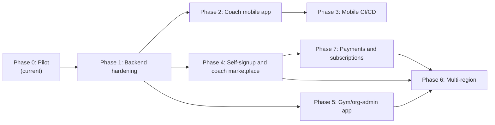

# GymOS Platform Roadmap

Living document. Revised at the start and end of each phase. Major architectural
decisions land as ADRs under [`docs/adr/`](./adr/) — this file tracks **where we
are**, **what comes next**, and **why the order matters**.

Last updated: 2026-08-13 (Phase 4 product vision expanded: coach portfolio +
sellable plans; Phase 7 payments/subscriptions and Phase 5 gym→coach invites
scoped as follow-ons).

---

## Guiding principle

The backend — auth, RBAC, domain modules, and the contracts client — is the **one
thing every app depends on**: coach web, coach mobile, the future client app, and
the gym/org-admin app. Every phase must leave that layer **more solid and more
scalable**, not less, before new UI surfaces are added.

Frontend apps are deployments of shared feature packages (`packages/app*`) onto
platform shells (`apps/web*`, `apps/mobile*`). They must not invent their own
auth, tenancy, or authorization models.

---

## Where we are today (Phase 0 — Pilot)

| Layer    | State                                                                                                       |
| -------- | ----------------------------------------------------------------------------------------------------------- |
| Product  | Single-coach, coaching-first web app: vitals, goals, check-ins, coach-reviewed meal plans                   |
| Monorepo | Turborepo + pnpm: `apps/{web,api,worker,mobile}`, `packages/{app,ui,platform,contracts,core,modules,db,ai}` |
| Frontend | Next.js 16 + Solito + Tamagui + react-native-web; screens in `packages/app`; Expo Router in `apps/mobile`   |
| Auth     | Email + password; JWT access + rotating refresh sessions (ADR-0002) — replaces shared gate cookie           |
| Tenancy  | Shared-schema + app scoping + RLS backstop (ADR-0003); per-org config registry (ADR-0004)                   |
| RBAC     | Full role matrix in `@gymos/core/rbac`; list queries scoped by org / outlet / assignment                    |
| Data     | Neon Postgres 17, Drizzle ORM                                                                               |
| Deploy   | PaaS pilot (Vercel web + Render API + Neon) and/or Oracle VM path                                           |
| Mobile   | **In progress** — Expo Router app (ADR-0005) + CI bundle/EAS/Maestro workflows                              |

Phase markers already in code (`P0`–`P5`) map roughly onto the phases below; this
document is the authoritative sequencing.

---

## Phase map

Phases 2/3 (coach mobile) and 4/5 (marketplace, gym-admin) all branch off
Phase 1. They are independent apps/surfaces on one hardened backend — not a
strict chain. After Phase 1, sequencing 2/3 vs 4/5 is a product-priority call.
This roadmap executed 2/3 first (coach mobile was the original request);
Phase 4 was rescoped afterward when the product direction shifted from
admin/coach-provisioned accounts to self-service signup — see below.
Phase 7 (payments) depends on Phase 4’s portfolio + listed plans being
discoverable before money moves.

---

## Phase 0 — Pilot (complete, in production)

**Scope.** Single-coach responsive web app; hybrid nutrition engine; coach review
before publish; free-tier infrastructure.

**Exit criteria (met).** Coach can onboard clients, record vitals, generate /
edit / publish meal plans, run weekly check-ins with adaptive adjustments;
PaaS or VM deploy path live.

**Non-goals (deferred intentionally).** Per-user login, native mobile, client
facing app, multi-org, push notifications.

---

## Phase 1 — Backend hardening (in progress)

**Why first.** A process-global principal cache, unscoped list queries, an
in-process rate limiter, and missing tenant columns on several tables are fine
for one coach — and become correctness / security bugs the moment a second user
or organization exists. Mobile, client, and gym-admin all consume this layer.

**Scope.**

| Slice | Outcome                                                                                                         |
| ----- | --------------------------------------------------------------------------------------------------------------- |
| 1a    | Real per-user auth: email + password, short-lived JWT access token, rotating refresh tokens, session revocation |
| 1b    | Per-request principal resolution from the verified JWT (no process-global cache)                                |
| 1c    | List/query endpoints filter by org / outlet / assigned clients; cross-tenant isolation tests                    |
| 1d    | Postgres Row-Level Security as defense-in-depth (session GUCs)                                                  |
| 1e    | Backfill `outlet_id` / `org_id` onto tables that only had `client_id`; composite tenant-leading indexes         |
| 1f    | Shared-store rate limiting (correct under multi-instance API)                                                   |
| 1g    | Per-org tenant config registry (replace single cached manifest file)                                            |
| 1h    | ESLint `app-client` / `app-admin` boundaries reserved ahead of those apps                                       |

**Entry criteria.** Phase 0 live; plan approved.

**Exit criteria.**

- Login issues access + refresh tokens; `/v1/*` accepts `Authorization: Bearer`
  (web: httpOnly refresh cookie + in-memory access token; mobile: SecureStore).
- Concurrent distinct users never share principal state.
- Cross-tenant list queries return zero rows in integration tests.
- RLS policies active on tenant-scoped tables.
- Rate limit remains correct with ≥2 API instances.
- ADR(s) recorded for auth and multi-tenant isolation choices.

**Non-goals.** SSO / SAML / OIDC; schema-per-tenant or DB-per-tenant; push
notifications; progress-photo upload APIs.

---

## Phase 2 — Coach mobile app (in progress)

**Scope.** `apps/mobile`: Expo + Expo Router, native-only, feature parity with
the coach web app by reusing `@gymos/app` screens. Platform `.native` / `.web`
splits for storage, theme, desktop breakpoint, PDF share, signature pad. Shell
fixes for flex + safe-area (no `100vh` / `position: fixed`).

**Entry criteria.** Phase 1 exit criteria met (mobile authenticates via the same
JWT / refresh contract).

**Exit criteria.** All coach routes reachable on iOS and Android simulators /
dev clients; auth login / refresh / logout works; PDFs shareable; signature pad
works on device.

**Non-goals.** Client or gym-admin mobile surfaces; Expo web target; store
submission.

**Working PR.** Stacked after Phase 1 PRs — see `cursor/coach-mobile-app-6eda`.

---

## Phase 3 — Mobile CI/CD (in progress)

**Scope.** Bundle-check in `ci.yml`; EAS preview builds + OTA updates on PRs;
EAS production update / build+submit on `main` (gated until Apple / Google
accounts exist); Jest + RNTL unit tests; Maestro critical-path E2E.

**Entry criteria.** Phase 2 app boots and typechecks.

**Exit criteria.** PR merges cannot land a broken Metro bundle; labeled PRs get
installable previews; `main` can OTA JS-only changes and auto-build on native
fingerprint changes when `PILOT_MOBILE_DEPLOY_ENABLED=true`.

**Non-goals.** Public App Store / Play Store release automation without human
promote; Detox as default E2E (reserved for gray-box hotspots only).

**Working PR.** Stacked after Phase 2 — see `cursor/mobile-cicd-6eda`.

---

## Phase 4 — Self-signup and coach marketplace (rescoped; coach OTP signup in progress)

**Why rescoped.** The original Phase 4 assumed a _seeded, admin/coach-provisioned_
client logging in to view a published plan. Product direction has since shifted:
the coach surface is a **standalone product**. Coaches self-signup, build a
public portfolio, and list sellable coaching plans. Clients (future client app)
browse that marketplace, pick a coach and a plan, and hire without an admin in
the loop. Both sides then communicate in-app around a shared plan and vitals
history. This is a bigger change than the original Phase 4 and touches identity,
catalog, and (later) payments — so it gets its own sub-phased rollout (mirrors
the Phase 1a–1h slicing).

**Product vision — coach as a standalone app.**

- **Self-signup + portfolio.** Coach creates an account and a public profile:
  bio, **experience level**, **expertise** areas (e.g. weight loss, strength,
  rehab), optional media later. Portfolio is the unit clients and gyms discover.
- **Sellable plans (catalog).** A coach lists one or more plans with a price.
  Each plan **must** include an **exercise plan**; a **diet / meal plan is
  optional**. Plans are goal-oriented (e.g. “lose weight”: textual exercise
  progression + optional meal guidance). v1 content is **textual only** —
  structured descriptions of exercises, sets/reps/notes, meal outlines. Image
  or video demos of how to perform an exercise are an explicit later slice.
- **Client discovery (client app, later in this phase).** Clients explore
  coaches by experience, expertise, listed plans + prices, and (once Phase 7 /
  ratings land) reviews. They choose a plan — and optionally **live coaching**
  on top, priced from the coach’s hourly / monthly rates (billing executes in
  Phase 7).
- **Gym discovery (Phase 5).** Gym chains browse the same public coach catalog
  (ratings, client load, reviews, rates) and can **invite a coach to join** with
  an offer — see Phase 5.

**Key decision — "coach is the tenant".** Independent coaches each get their
own `organizations`/`outlets`/`tenant_configs` row auto-provisioned at signup
(or join an existing org via a `joinCode`). Client signup and "hiring" a coach
are the _same_ atomic call, so a logged-in user always has a real membership —
this preserves the ADR-0002/0003 invariant that every JWT carries a real
`orgId`/`outletId`, instead of introducing an "unaffiliated user" auth state.
The public coach directory is the one deliberately cross-tenant read path
(opt-in fields only) and needs extra review scrutiny for that reason.

**Active now (Scope B):** email OTP + forgot-password + coach self-signup
(ADR-0006). Phone uniqueness without SMS. Client marketplace + portfolio/
catalog slices deferred until after 4b.

**Scope.**

| Slice | Outcome                                                                                                                         |
| ----- | ------------------------------------------------------------------------------------------------------------------------------- |
| 4a    | ADR-0006 + migration: `organizations.joinCode`, `otp_challenges`, user email/phone verified columns (messaging tables deferred) |
| 4b    | Coach self-signup (`POST /v1/auth/signup/coach/*`) + password forgot/reset via email OTP — **in progress**                      |
| 4c    | Coach portfolio fields: experience level, expertise tags, public bio; public directory exposes opted-in profile                 |
| 4d    | Coach plan catalog: priced plans; **exercise plan required**, **diet plan optional**; textual content only                      |
| 4e    | Public coach directory (`GET /v1/coaches/directory`) lists profile + plans/prices; atomic client signup-and-hire                 |
| 4f    | RBAC/API glue: wire `ownerUserId` into self-scoped `authorize()` so clients can read own plan/vitals/dietary                    |
| 4g    | In-app messaging: `conversations`/`messages` scoped to the active `coachAssignment`, polling-based (no push/websockets yet)     |
| 4h    | `packages/app-client` UI: directory browse, hire CTA, client home (plan/progress), messages — web + mobile                      |
| 4i    | _(later)_ Exercise media: coach-uploaded images/videos demonstrating how to perform catalog exercises                           |

**Entry criteria.** Phase 1 complete.

**Exit criteria.** A coach can self-signup (with or without a join code), land
on their own tenant, and publish a portfolio with experience/expertise plus at
least one priced plan (exercise required, diet optional, textual); a client can
browse public coach profiles and plans, sign up, and hire a coach in one step;
the resulting client can log in and read their own published plan and vitals
history; coach and client can exchange messages tied to their active
assignment; no cross-tenant data leaks through the directory beyond opted-in
public fields.

**Non-goals.** Concurrent multi-coach clients; coach switching/rehiring;
**payment capture / subscription billing** (Phase 7 — catalog prices are
display-only until then); live-coaching fee collection; real-time chat or push
notifications (v1 is polling); multi-coach practices/teams under one org;
ratings/reviews (target with Phase 5/7 marketplace maturity); content
moderation; guardian/dependent accounts; exercise image/video upload (slice 4i).

---

## Phase 5 — Gym / org-admin app

**Scope.** Cross-outlet reporting and management for a gym chain
(`ORG_ADMIN` with `outlet_id = NULL` already means “all branches in this org”).
Web-first dashboards (`packages/app-admin` + `apps/web-admin`).

**Marketplace follow-on — gym invites coaches.** Once the public coach directory
exists (Phase 4), a gym/org admin can:

- Browse available coaches: experience, expertise, ratings/reviews (when
  shipped), active client load, listed plan prices, and live-coaching rates.
- **Send an invite** to a coach with a concrete offer (compensation / role /
  outlet assignment — exact offer schema TBD; capture intent in an ADR when
  this slice starts).
- Coach accepts or declines; acceptance links the coach into the gym org
  (likely via the existing join-code / membership path, or a dedicated invite
  token — decide in ADR).

Invite mechanics are deliberately high-level here; implementation details land
in an ADR at slice kickoff.

**Entry criteria.** Phase 1 complete; at least one multi-outlet org in staging;
Phase 4 directory + portfolio readable for the invite browse path.

**Exit criteria.** Org admin can list outlets, see aggregated roster / attention
across branches, manage memberships; can discover marketplace coaches and send
an invite-with-offer; cannot see other organizations’ private data.

**Non-goals.** Platform-operator cross-org console (distinct from chain
`ORG_ADMIN`); billing / invoicing of gym↔coach contracts (may reuse Phase 7
rails later); automated matching / ranking of coaches for gyms.

---

## Phase 6 — Multi-region

**Scope.** Independent regional deployments (separate Neon project + API per
region) when a paying customer requires a distant geography or hard data
residency. Route new orgs to the nearest region at signup.

**Entry criteria.** Real customer / compliance need; Phases 1 and at least one
of 4/5/7 in production.

**Exit criteria.** Second region serves its orgs with local read/write latency;
no silent cross-region data mixing.

**Non-goals.** Active-active synchronous multi-region Postgres; premature
schema-per-tenant or DB-per-tenant (revisit only for enterprise isolation /
noisy-neighbor / compliance triggers).

---

## Phase 7 — Payments and subscriptions

**Why after Phase 4.** Catalog prices and live-coaching rates are meaningless
without a payment rail — but the rail is useless until coaches have portfolios
and listed plans clients can choose. Phase 7 turns “hire” from a free
assignment into a paid subscription.

**Scope (high level; ADR at kickoff).**

| Slice | Outcome                                                                                                      |
| ----- | ------------------------------------------------------------------------------------------------------------ |
| 7a    | Payment gateway integration (provider TBD in ADR); coach payout / platform fee model sketched                |
| 7b    | Client subscribes to a specific coach **plan** with **upfront payment**; can **unsubscribe** later           |
| 7c    | Optional **live coaching** add-on: coach configures **hourly** and/or **monthly (full-time)** rates; client picks plan-only vs plan + live coaching at higher price |
| 7d    | Subscription lifecycle: active / past-due / canceled; access to plan content gated on status                 |
| 7e    | Client-app UX: checkout, manage subscription, cancel; coach-app UX: rates, plan prices, payout status        |

**Entry criteria.** Phase 4 exit for portfolio + plan catalog (prices displayable);
legal / tax posture for collecting funds decided at kickoff.

**Exit criteria.** A client can pay in-app to subscribe to a coach plan (with or
without live coaching), receive access immediately after successful upfront
payment, and cancel later; coaches can set plan prices plus hourly/monthly live
rates; no access to paid plan content without an active (or grace) subscription.

**Non-goals.** Gym↔coach employment payroll; multi-currency complexity beyond
what the chosen gateway requires for the first market; crypto; offline cash
reconciliation as a first-class path.

---

## Explicitly deferred (all phases)

- SSO / SAML / OIDC federation
- Active-active multi-region database
- Schema-per-tenant or DB-per-tenant as the default model
- Push notifications (FCM / APNs)
- Progress-photo upload API (table exists; no endpoints yet)
- Store submission without Apple / Google developer accounts
- Guardian / dependent access
- Concurrent multi-coach clients / coach switching or rehiring
- Real-time chat or push-notified messaging (Phase 4 messaging is polling-based)
- Coach teams / multiple coaches under one self-signup org
- Content moderation tooling for the coach directory
- Exercise image/video upload for plan demos (Phase 4 slice 4i — not v1)
- Ratings / reviews as a prerequisite for first hire (ship when marketplace
  volume justifies; useful for both client browse and gym invites)

---

## How to update this document

1. At **phase kickoff**: set status to _in progress_, link the working PR(s).
2. At **phase exit**: mark exit criteria met, link merged PRs and any new ADRs.
3. Do **not** bury architecture decisions here — open an ADR under `docs/adr/`.

ADRs recorded so far:

- [ADR-0002](./adr/0002-jwt-refresh-sessions.md): JWT access + rotating refresh tokens
- [ADR-0003](./adr/0003-shared-schema-tenant-isolation.md): shared schema + application scoping + RLS backstop
- [ADR-0004](./adr/0004-tenant-config-registry.md): per-org tenant config registry
- [ADR-0005](./adr/0005-expo-router-solito-mobile.md): Expo Router + Solito (native shell over shared screens)

ADRs for Phase 4:

- [ADR-0006](./adr/0006-coach-self-signup-otp.md): coach self-signup + email OTP
  ("coach is the tenant", join codes). Client hire / directory / portfolio +
  plan-catalog ADR follow-up when 4c–4d start.

ADRs still needed (open at slice kickoff, not before):

- Coach portfolio + plan catalog shape (experience, expertise, exercise-required /
  diet-optional plans, textual content)
- Client hire / public directory fields
- Gym→coach invite-with-offer protocol (Phase 5)
- Payment gateway + subscription lifecycle (Phase 7)
