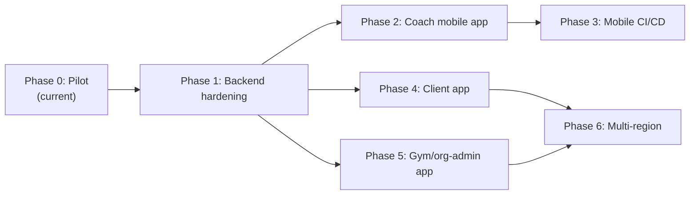

# GymOS Platform Roadmap

Living document. Revised at the start and end of each phase. Major architectural
decisions land as ADRs under [`docs/adr/`](./adr/) — this file tracks **where we
are**, **what comes next**, and **why the order matters**.

Last updated: 2026-08-11 (Phase 1g–1h in progress; 1a–1f in review).

---

## Guiding principle

The backend — auth, RBAC, domain modules, and the contracts client — is the **one
thing every app depends on**: coach web, coach mobile, the future client app, and
the gym/org-admin app. Every phase must leave that layer **more solid and more
scalable**, not less, before new UI surfaces are added.

Frontend apps are deployments of shared feature packages (`packages/app*`) onto
platform shells (`apps/web*`, `apps/mobile*`). They must not invent their own
auth, tenancy, or authorization models.

---

## Where we are today (Phase 0 — Pilot)

| Layer    | State                                                                                                                |
| -------- | -------------------------------------------------------------------------------------------------------------------- |
| Product  | Single-coach, coaching-first web app: vitals, goals, check-ins, coach-reviewed meal plans                            |
| Monorepo | Turborepo + pnpm: `apps/{web,api,worker}`, `packages/{app,ui,platform,contracts,core,modules,db,ai}`                 |
| Frontend | Next.js 16 + Solito + Tamagui + react-native-web; screens live in `packages/app`                                     |
| Auth     | Email + password; JWT access + rotating refresh sessions (ADR-0002) — replaces shared gate cookie                    |
| Tenancy  | Shared-schema + app scoping + RLS backstop (ADR-0003); per-org config registry (ADR-0004)                            |
| RBAC     | Full role matrix in `@gymos/core/rbac`; list queries scoped by org / outlet / assignment                             |
| Data     | Neon Postgres 17, Drizzle ORM                                                                                        |
| Deploy   | PaaS pilot (Vercel web + Render API + Neon) and/or Oracle VM path                                                    |
| Mobile   | **Not started** — `apps/mobile` does not exist; ESLint reserves `app-mobile` / `app-client` / `app-admin` boundaries |

Phase markers already in code (`P0`–`P5`) map roughly onto the phases below; this
document is the authoritative sequencing.

---

## Phase map

Phases 2/3 (coach mobile) and 4/5 (client, gym-admin) all branch off Phase 1.
They are independent apps on one hardened backend — not a strict chain. After
Phase 1, sequencing 2/3 vs 4/5 is a product-priority call. This roadmap executes
2/3 next (coach mobile was the original request).

---

## Phase 0 — Pilot (complete, in production)

**Scope.** Single-coach responsive web app; hybrid nutrition engine; coach review
before publish; free-tier infrastructure.

**Exit criteria (met).** Coach can onboard clients, record vitals, generate /
edit / publish meal plans, run weekly check-ins with adaptive adjustments;
PaaS or VM deploy path live.

**Non-goals (deferred intentionally).** Per-user login, native mobile, client
facing app, multi-org, push notifications.

---

## Phase 1 — Backend hardening (in progress)

**Why first.** A process-global principal cache, unscoped list queries, an
in-process rate limiter, and missing tenant columns on several tables are fine
for one coach — and become correctness / security bugs the moment a second user
or organization exists. Mobile, client, and gym-admin all consume this layer.

**Scope.**

| Slice | Outcome                                                                                                         |
| ----- | --------------------------------------------------------------------------------------------------------------- |
| 1a    | Real per-user auth: email + password, short-lived JWT access token, rotating refresh tokens, session revocation |
| 1b    | Per-request principal resolution from the verified JWT (no process-global cache)                                |
| 1c    | List/query endpoints filter by org / outlet / assigned clients; cross-tenant isolation tests                    |
| 1d    | Postgres Row-Level Security as defense-in-depth (session GUCs)                                                  |
| 1e    | Backfill `outlet_id` / `org_id` onto tables that only had `client_id`; composite tenant-leading indexes         |
| 1f    | Shared-store rate limiting (correct under multi-instance API)                                                   |
| 1g    | Per-org tenant config registry (replace single cached manifest file)                                            |
| 1h    | ESLint `app-client` / `app-admin` boundaries reserved ahead of those apps                                       |

**Entry criteria.** Phase 0 live; plan approved.

**Exit criteria.**

- Login issues access + refresh tokens; `/v1/*` accepts `Authorization: Bearer`
  (web: httpOnly refresh cookie + in-memory access token; mobile: SecureStore).
- Concurrent distinct users never share principal state.
- Cross-tenant list queries return zero rows in integration tests.
- RLS policies active on tenant-scoped tables.
- Rate limit remains correct with ≥2 API instances.
- ADR(s) recorded for auth and multi-tenant isolation choices.

**Non-goals.** SSO / SAML / OIDC; schema-per-tenant or DB-per-tenant; push
notifications; progress-photo upload APIs.

---

## Phase 2 — Coach mobile app

**Scope.** `apps/mobile`: Expo + Expo Router, native-only, feature parity with
the coach web app by reusing `@gymos/app` screens. Platform `.native` / `.web`
splits for storage, theme, desktop breakpoint, PDF share, signature pad. Shell
fixes for flex + safe-area (no `100vh` / `position: fixed`).

**Entry criteria.** Phase 1 exit criteria met (mobile authenticates via the same
JWT / refresh contract).

**Exit criteria.** All coach routes reachable on iOS and Android simulators /
dev clients; auth login / refresh / logout works; PDFs shareable; signature pad
works on device.

**Non-goals.** Client or gym-admin mobile surfaces; Expo web target; store
submission.

---

## Phase 3 — Mobile CI/CD

**Scope.** Bundle-check in `ci.yml`; EAS preview builds + OTA updates on PRs;
EAS production update / build+submit on `main` (gated until Apple / Google
accounts exist); Jest + RNTL unit tests; Maestro critical-path E2E.

**Entry criteria.** Phase 2 app boots and typechecks.

**Exit criteria.** PR merges cannot land a broken Metro bundle; labeled PRs get
installable previews; `main` can OTA JS-only changes and auto-build on native
fingerprint changes when `PILOT_MOBILE_DEPLOY_ENABLED=true`.

**Non-goals.** Public App Store / Play Store release automation without human
promote; Detox as default E2E (reserved for gray-box hotspots only).

---

## Phase 4 — Client app

**Scope.** Mobile-first client experience (`packages/app-client` +
`apps/mobile-client`, optional light web). Uses existing `CLIENT` role and
`self` scope. Client sees published plans, check-in prompts, own vitals history.

**Entry criteria.** Phase 1 complete; product prioritizes client over (or after)
coach mobile.

**Exit criteria.** Seeded client can log in, view published plan, complete
self-reported check-in fields as designed; no coach-only data leaks.

**Non-goals.** Guardian / dependent flows (earlier code comments: P5); social
features.

---

## Phase 5 — Gym / org-admin app

**Scope.** Cross-outlet reporting and management for a gym chain
(`ORG_ADMIN` with `outlet_id = NULL` already means “all branches in this org”).
Web-first dashboards (`packages/app-admin` + `apps/web-admin`).

**Entry criteria.** Phase 1 complete; at least one multi-outlet org in staging.

**Exit criteria.** Org admin can list outlets, see aggregated roster / attention
across branches, manage memberships; cannot see other organizations.

**Non-goals.** Platform-operator cross-org console (distinct from chain
`ORG_ADMIN`); billing / invoicing.

---

## Phase 6 — Multi-region

**Scope.** Independent regional deployments (separate Neon project + API per
region) when a paying customer requires a distant geography or hard data
residency. Route new orgs to the nearest region at signup.

**Entry criteria.** Real customer / compliance need; Phases 1 and at least one
of 4/5 in production.

**Exit criteria.** Second region serves its orgs with local read/write latency;
no silent cross-region data mixing.

**Non-goals.** Active-active synchronous multi-region Postgres; premature
schema-per-tenant or DB-per-tenant (revisit only for enterprise isolation /
noisy-neighbor / compliance triggers).

---

## Explicitly deferred (all phases)

- SSO / SAML / OIDC federation
- Active-active multi-region database
- Schema-per-tenant or DB-per-tenant as the default model
- Push notifications (FCM / APNs)
- Progress-photo upload API (table exists; no endpoints yet)
- Store submission without Apple / Google developer accounts
- Guardian / dependent access

---

## How to update this document

1. At **phase kickoff**: set status to _in progress_, link the working PR(s).
2. At **phase exit**: mark exit criteria met, link merged PRs and any new ADRs.
3. Do **not** bury architecture decisions here — open an ADR under `docs/adr/`.

Suggested upcoming ADRs during Phase 1–2:

- Auth: JWT access + rotating refresh tokens
- Multi-tenant isolation: shared schema + application scoping + RLS backstop
- Mobile: Expo Router + Solito (native shell over shared screens)
